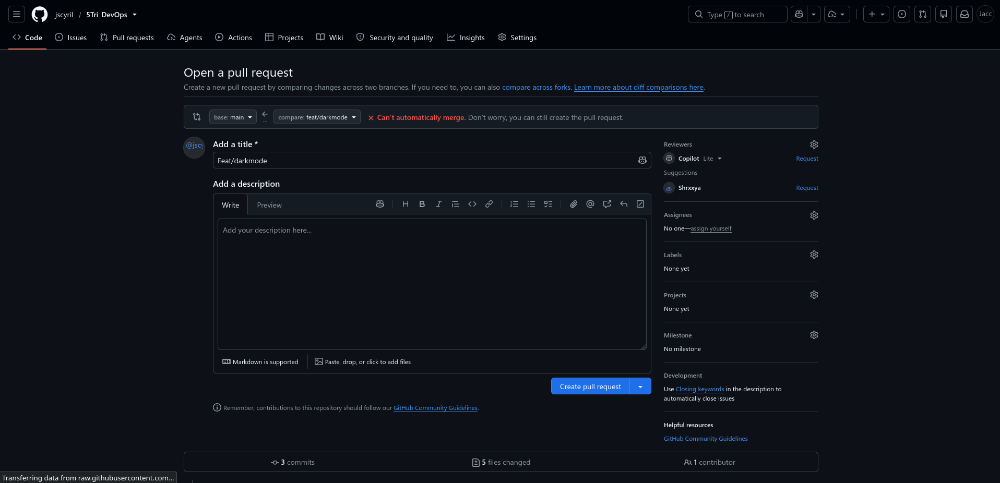
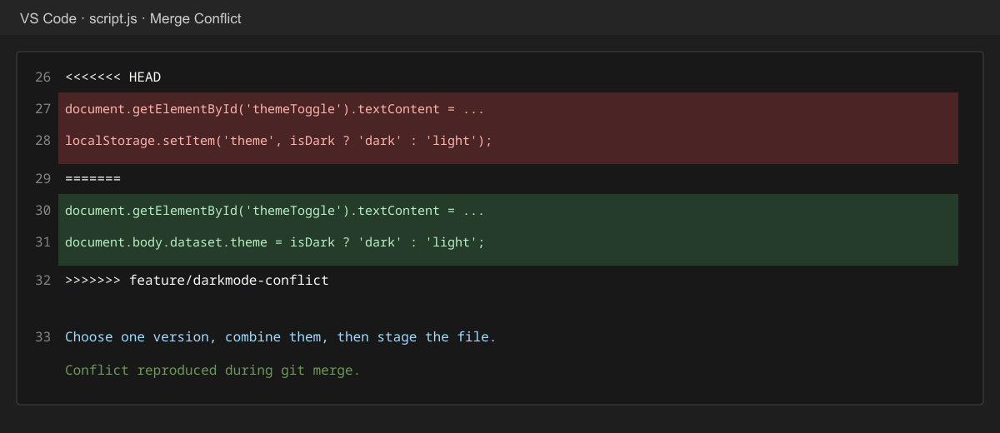
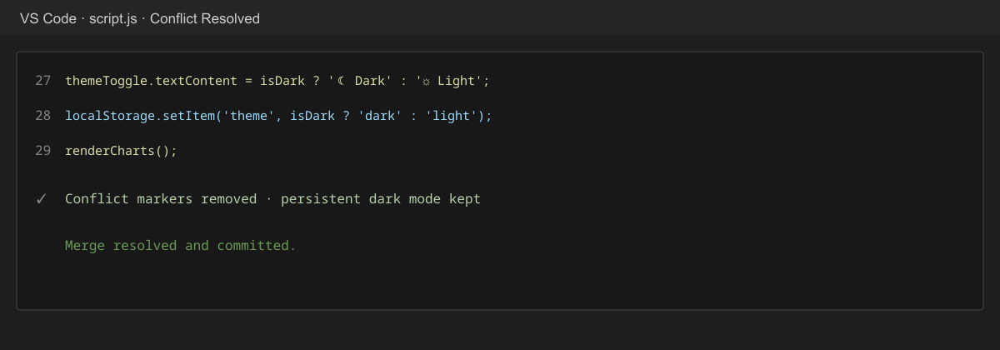

# TriFusion — MCA Project Portfolio

## Team Members

- Shreeya Bajpai
- Raju P
- Jacob Sebastian Cyril

## Project Description

TriFusion is a browser-based portfolio that brings together the team’s three projects from the previous trimester in one interface. It currently presents the Echelon security console and AquaVision computer-vision project through a shared navigation experience. The Echelon dashboard includes threat monitoring, attack-vector charts, access controls, and a persistent light/dark mode toggle.

## Technologies Used

- HTML5
- CSS3 and responsive CSS
- JavaScript
- Tailwind CSS CDN
- Lucide icons
- Git and GitHub

## Git Branching Strategy

- `main` is the shared stable branch.
- Each feature is developed on a separate branch.
- Changes are pushed to GitHub and submitted through pull requests.
- Pull requests are reviewed before feature branches are merged into `main`.

## Pull Requests Created

- `feature/darkmode-conflict` → `feat/darkmode`: competing dark-mode implementation used to demonstrate a merge conflict.
- `feat/darkmode` → `main`: dark mode, conflict-resolution evidence, and final merged implementation.

## Merge Conflict

### What caused the conflict?

Both branches changed the same dark-mode toggle code in `script.js`. One branch added persistent storage with `localStorage`; the other updated the page theme state using `data-theme`. Because the same lines were changed differently, GitHub displayed **“Can’t automatically merge.”**

### How was it resolved?

The two implementations were combined. The final version toggles the `.dark` class, saves the selected theme in `localStorage`, updates `data-theme`, updates the button label, and redraws the charts. All conflict markers were removed, then the resolved file was staged and committed:

```bash
git add script.js
git commit -m "Resolve dark mode merge conflict"
git push origin feat/darkmode
```

### Merge evidence







## How to Run the Application

Clone the repository, enter the project directory, and start a local web server:

```bash
git clone https://github.com/jscyril/5Tri_DevOps.git
cd 5Tri_DevOps
python3 -m http.server 8000
```

Open [http://localhost:8000](http://localhost:8000) in a browser. The application uses CDN resources, so an internet connection is required for Tailwind CSS, Lucide icons, and web fonts.

## Project Files

- `index.html` — main Echelon dashboard
- `Landing.html` — AquaVision project view
- `styles.css` — application styling and themes
- `script.js` — navigation, charts, project switching, and dark mode
- `project-description.md` — additional project details
